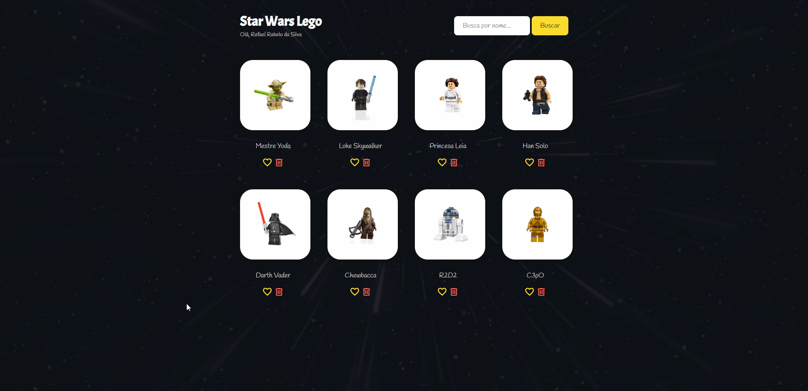

# O curso ✨

Este projeto foi desenvolvido no curso **Javascript para QAs** ministrado pelo **Fernando Papito**. 
Neste curso aprendemos sobre JavaScript, HTML e CSS. Trabalhamos com variáveis, constantes, funções, arrays, objetos, loops, operadores e controle de fluxo utilizando o framework Vue.js.

## Conteúdo do Curso

* Introdução ao JavaScript
* HTML
* CSS
* Variáveis de Tipos de Dados
* Operadores matemáticos
* Operadores de comparação
* Funções
* Controle de fluxos e BDD
* Arrays
* Controles de repetição
* Objetos
* Constantes
* Vue.js
* Renderizando items com v-for
* Implementando funções
* Criando um filtro de busca
* Exclusão lógica
* Google Icons
* Google Fonts

## Exibindo o projeto

